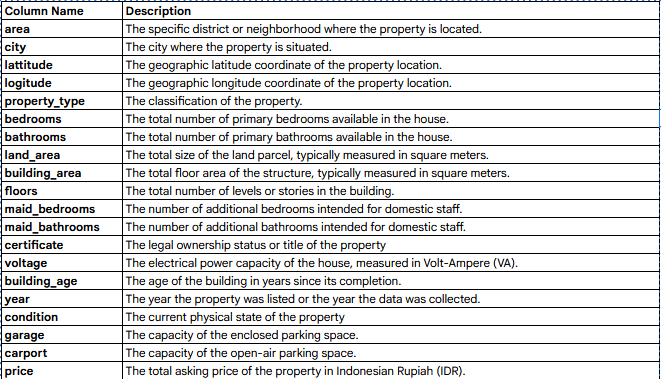

# 🏡 House Price Prediction

> **A data-driven predictive model designed to estimate residential property values and support informed purchasing decisions.**

---

## 📖 Problem Background
Purchasing a residential property represents a significant milestone for many individuals. However, navigating the complexities of the real estate market within a specific budget can be an overwhelming endeavor. Property values are influenced by a diverse array of characteristics and variables, and assessing these factors objectively often proves challenging due to inherent cognitive biases.

This project is driven by the need to provide a systematic framework that assists prospective buyers in evaluating their options through data-driven insights.

## 🎯 Project Output
The primary goal of this project is to develop a **predictive model** that estimates property prices based on their specific attributes. By providing accurate price projections, this model enables homebuyers to:
* Align their financial expectations with market realities.
* Facilitate more informed and confident purchasing decisions.

## 🗂️ Repository Outline
```text
📦 House-Price-Prediction
 ┣ 📜 README.md                  # Project overview
 ┣ 📓 training_notebook.ipynb    # Notebook for building the model
 ┣ 📓 inference_notebook.ipynb   # Notebook for inferencing/predicting new data
 ┣ 📊 house-price-v2.csv         # Dataset for training the model
 ┣ 🖼️ dataset_description.png    # Description of dataset columns
 ┗ 📂 deployment                 # Folder containing deployment scripts
```

## 📊 Data
The following image describes the features and columns used in this project:



## ⚙️ Methodology
This model implements the **XGBoost** algorithm, which was determined to be the most reliable model compared to other candidates during the evaluation phase. The models compared include:
* ✅ **XGBoost (Selected Model)**
* 🌲 Random Forest
* 📈 Linear Regression (Ridge)
* 📉 Linear Regression (Lasso)
* 〰️ Linear Regression (Polynomial)

## 💻 Tech Stack
* **Language:** Python 🐍
* **Tools:** Visual Studio Code, Streamlit, HuggingFace 🤗

## 🚀 Reference & Deployment
The model is live and can be accessed interactively at the link below:

🔗 **[HuggingFace Deployment: House Price Prediction](https://huggingface.co/spaces/RifqiAs/House_Price_Prediction)**

---
