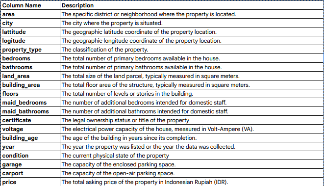

# IDX LQ45's Stock Prediction

## Repository Outline
```
1. README.md - Penjelasan gambaran umum project
2. P1M2_rifqi_asyrafi.ipynb - Notebook for build model
3. P1M2_rifqi_asyrafi_inf.ipynb - Notebook for inferencing/predicting new data
4. P1M2_rifqi_asyrafi.csv - Dataset for training model
5. P1M2_rifqi_asyrafi_inf.csv - New data which will be predicted
6. P1M2_rifqi_asyrafi_conceptual.txt - Conceptual explanation about the choosen algorithm
7. Deployment - Python script for deployment
9. dataset_descriptopn.png - Description of dataset columns
```

## Problem Background
The potential of Indonesia's Stock Market is attractive and considerable. For being a part of drive the market, we should have robust consideration for gaining the greatest profit within certain period of time. Understanding stock market is a complex job and very tiring. We should consider many aspects affecting stock price. For helping us to understand market quickly, we need smart tool to identify the potential of each stock day by day. Based on this problem, we need to build a tools to give recommendation of prospect stock.

## Project Output
For addressing the problem above, this project is developed to build a model for predicting potential stocks. This model learns from stocks on LQ45 IDX Index for classifying which stocks will mount by 3% within 5 days.

## Data

`Bagian ini menjelaskan secara singkat mengenai data yang digunakan seperti sumber data, deskripsi singkat karakteristik data seperti jumlah kolom, baris data, missing values, dsb`

## Method
This model implement XGBoost algoritm which is the most reliable model than compared models, KNN, Decision Tree, Random Forest and SVC.

## Stacks
Language    : Python
Tools       : Visual Studio Code, Streamlit, Docker

## Reference

---